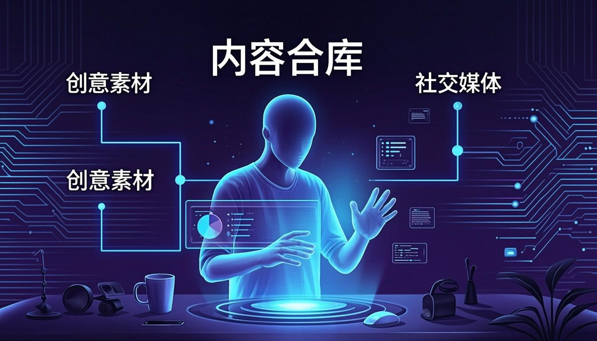
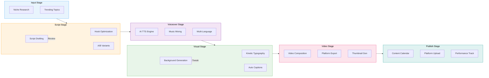
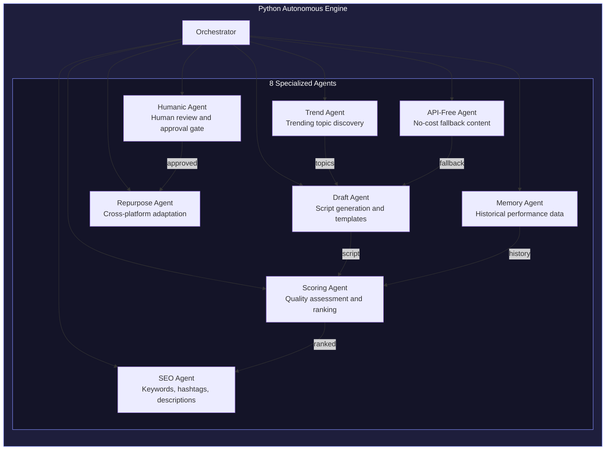
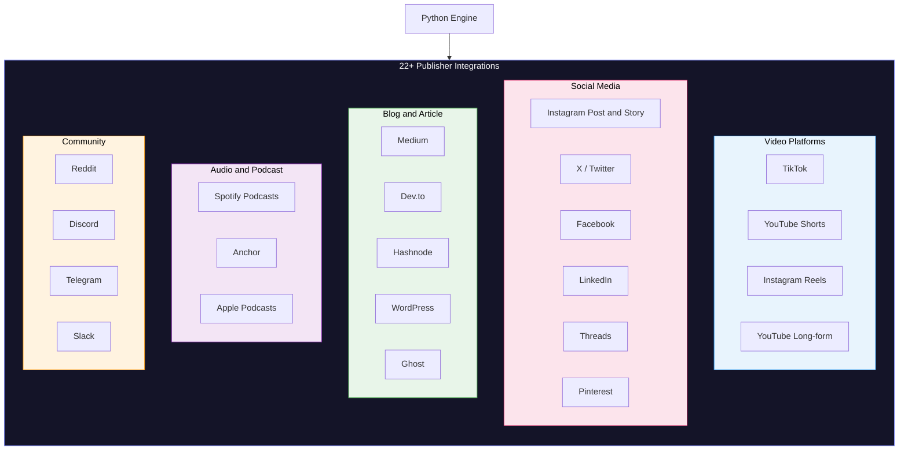
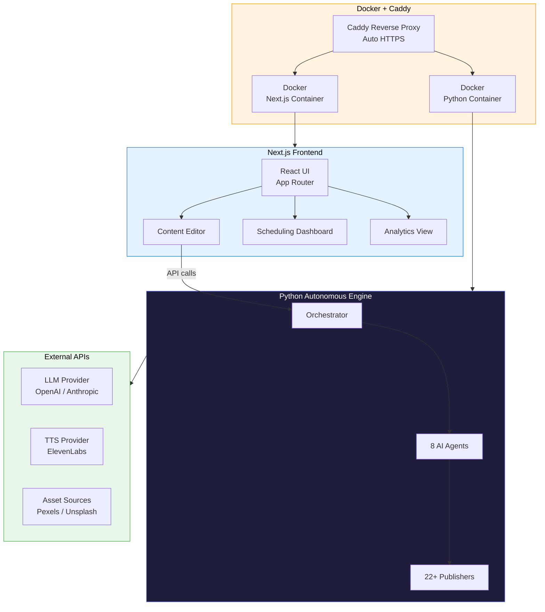

<!-- CAPSULE-RENDER HEADER -->


<!-- TYPING SVG -->
<div align="center">
  <a href="https://git.io/typing-svg">
    
  </a>
</div>

<br/>

<!-- BADGES -->
<div align="center">

[](https://www.typescriptlang.org/)
[](https://nextjs.org/)
[](#)
[](./LICENSE)

</div>

---

## Overview

**GhostStudio AI** is a faceless content generation platform that creates short-form video content for TikTok, YouTube Shorts, and Instagram Reels -- without ever requiring you to appear on camera. The AI pipeline handles script writing, voiceover generation, visual asset selection, and video composition, producing ready-to-upload content in minutes.

Whether you're building a faceless brand, testing content niches, or scaling your content production, GhostStudio AI automates the creative heavy lifting so you can focus on strategy and distribution.

## Features

### AI Script Generation
- Niche-specific script templates (finance, motivation, facts, storytelling, etc.)
- Hook optimization for maximum retention
- Trending topic discovery and script suggestion
- Multi-language script generation
- Script variations for A/B testing content

### AI Voiceover
- Multiple AI voice profiles (male, female, various accents)
- Adjustable pacing, emphasis, and tone
- Background music auto-mixing
- Voice cloning capabilities (with consent)
- Multi-language voiceover support

### Visual Composition
- AI-generated background visuals and animations
- Text overlay with kinetic typography
- Stock footage and image integration
- Caption/subtitle auto-generation
- Brand-consistent visual templates

### Video Assembly Pipeline
- Automated end-to-end content production
- Platform-specific export settings (TikTok 9:16, Shorts, Reels)
- Batch content generation for scheduling
- Thumbnail and cover image generation
- Hashtag and description suggestions

### Content Management
- Content calendar and scheduling
- Performance analytics integration
- Niche performance tracking
- Content variant testing dashboard
- Export queue and batch processing

### Multi-Platform Support
- TikTok format optimization
- YouTube Shorts specifications
- Instagram Reels compatibility
- Cross-platform content adaptation

## Honest Notes

> **Setting realistic expectations:**

- **AI Content Quality Varies** -- Generated content ranges from impressive to mediocre. Scripts may need editing, AI voiceovers can sound robotic, and visual compositions sometimes require manual tweaks. Expect a human review step.
- **Viral Success Not Guaranteed** -- No tool can guarantee viral content. Success depends on timing, niche, audience, and many factors beyond content quality. GhostStudio AI produces content -- audience building is still your job.
- **Platform Algorithms Change** -- TikTok, YouTube, and Instagram regularly update their algorithms and content policies. What works today may not work tomorrow, and AI-generated content policies are evolving.
- **Content Saturation** -- As AI content tools become common, audiences may develop fatigue for AI-generated styles. Differentiation requires creativity beyond what any tool provides.
- **Platform Policies** -- Some platforms may require disclosure of AI-generated content. Stay informed about current policies and comply with disclosure requirements.

---

## Architecture Visualizations

### Content Generation Pipeline



### Python Agent Architecture



### Publisher Ecosystem



### Full Stack Architecture



---

## Quick Start

### Prerequisites
- Node.js 18+
- API keys for LLM and TTS providers

### Installation

```bash
# Clone the repository
git clone https://github.com/mulkymalikuldhrs/ghoststudio-ai.git
cd ghoststudio-ai

# Install dependencies
npm install

# Configure environment
cp .env.example .env
```

### Configuration

```env
# AI Providers
OPENAI_API_KEY=your_key
ELEVENLABS_API_KEY=your_key

# Asset Sources (optional)
PEXELS_API_KEY=your_key
UNSPLASH_ACCESS_KEY=your_key

# App
NEXT_PUBLIC_APP_URL=http://localhost:3000
DATABASE_URL=your_database_url
```

### Running

```bash
# Development
npm run dev

# Production
npm run build && npm start
```

---

## Project Structure

```
ghoststudio-ai/
├── src/
│   ├── app/                # Next.js app router
│   ├── components/
│   │   ├── editor/         # Content editing interface
│   │   ├── generator/      # Content generation views
│   │   ├── calendar/       # Scheduling dashboard
│   │   └── analytics/      # Performance views
│   ├── lib/
│   │   ├── pipeline/       # Content generation pipeline
│   │   ├── scripts/        # AI script generation
│   │   ├── voiceover/      # TTS integration
│   │   ├── visuals/        # Visual asset generation
│   │   ├── video/          # Video composition engine
│   │   └── platforms/      # Platform-specific exporters
│   └── types/              # TypeScript definitions
├── templates/              # Content templates
└── tests/                  # Test suites
```

---

## Contributing

1. Fork the repository
2. Create a feature branch
3. Add tests for new functionality
4. Submit a pull request

We're especially interested in:
- New content templates and niches
- Better visual composition algorithms
- Additional TTS provider integrations
- Platform-specific optimizations

---

## Disclaimer

GhostStudio AI is a content creation tool. Users are solely responsible for ensuring their content complies with platform terms of service, disclosure requirements for AI-generated content, copyright laws, and advertising regulations. The authors assume no liability for content produced using this tool or its performance on any platform.

---

## License

This project is licensed under the **MIT License** -- see the [LICENSE](./LICENSE) file for details.

---

## Author

<div align="center">

**Mulky Malikul Dhaher**

[](https://github.com/mulkymalikuldhrs)
[](mailto:mulkymalikudhr@mail.com)

</div>

---

<!-- FOOTER BANNER -->

